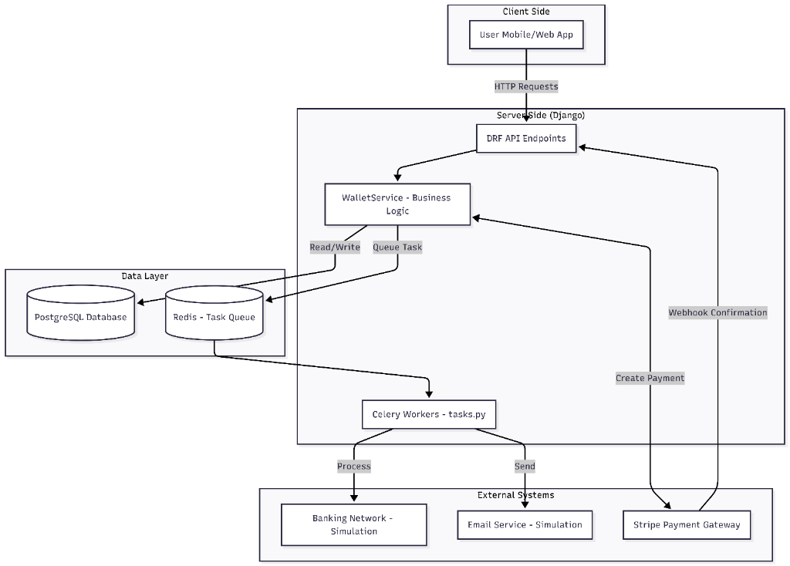
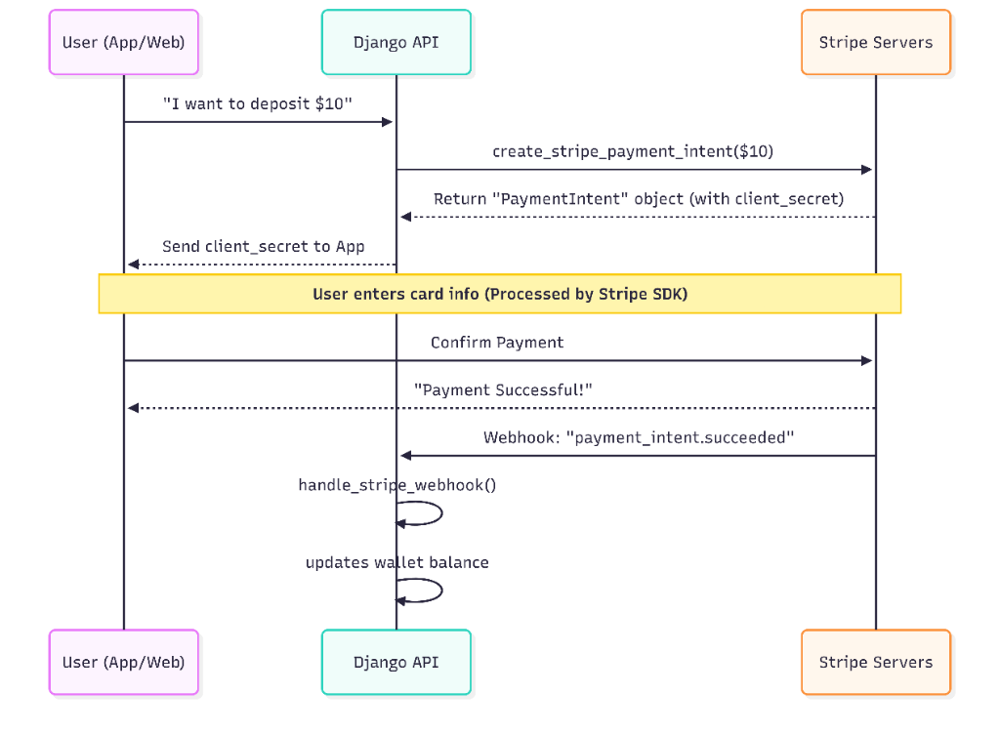

# LedgerPay API

LedgerPay is a secure, ledger-backed digital wallet system built with Django REST Framework. It provides robust financial primitives including balance tracking, peer-to-peer transfers, automated funding via Stripe, and withdrawal management.

## Project Overview

The system is designed with a strong focus on financial integrity. Instead of relying solely on a simple balance field, LedgerPay utilizes a ledger-based architecture where every movement of funds is recorded as a LedgerEntry. This ensures that the current balance can always be verified by aggregating all historical transactions, providing a complete audit trail.

## Core Features

### Wallet Management
- Secure balance inquiry with ledger-based aggregation.
- Automatic wallet creation upon user registration.
- Multi-currency support (defaulting to USD).

### P2P Transfers
- Instant transfers between registered users.
- Transactional integrity with row-level locking to prevent race conditions.
- Idempotency support to prevent duplicate transfers on retry.

### Funding and Withdrawals
- Stripe integration for secure credit card deposits.
- Asynchronous webhook processing for payment confirmation.
- Bank withdrawal initiation with immediate fund reservation.
- Simulation of background banking network processes via Celery.

### Security and Reliability
- Atomic database transactions for all financial operations.
- Object-level permission checks for transaction details.
- Signature verification for incoming Stripe webhooks.
- Comprehensive test suite covering unit, integration, and mock-based scenarios.

## Technical Architecture

### Backend Stack
- Django and Django REST Framework (DRF)
- PostgreSQL (Production) / SQLite (Development/Testing)
- SimpleJWT for stateless authentication
- Celery and Redis for asynchronous task management

### API Documentation
The API is fully documented using the OpenAPI 3.0 specification.
- Swagger UI: /api/docs/
- ReDoc: /api/redoc/

### Key Service Components
- WalletService: Centralized logic for all financial calculations and operations.
- Stripe Integration: Secure payment intent creation and webhook handling.
  
- Ledger System: Immutable record of fund movements tied to unique transaction IDs.

## API Endpoints

### Authentication
- POST /api/auth/register/ : User registration
- POST /api/auth/login/ : Login and JWT acquisition
- POST /api/auth/refresh/ : JWT refresh

### Wallet Operations
- GET /api/wallet/balance/ : Current balance and wallet ID
- GET /api/wallet/history/ : Paginated transaction history
- GET /api/transaction/{id}/ : Individual transaction details

### Financial Actions
- POST /api/transfers/ : P2P money transfer
- POST /api/funding/deposit/ : Initiate Stripe deposit
- POST /api/wallet/withdraw/ : Initiate bank payout
- POST /api/webhooks/stripe/ : Stripe payment confirmation (Incoming)
